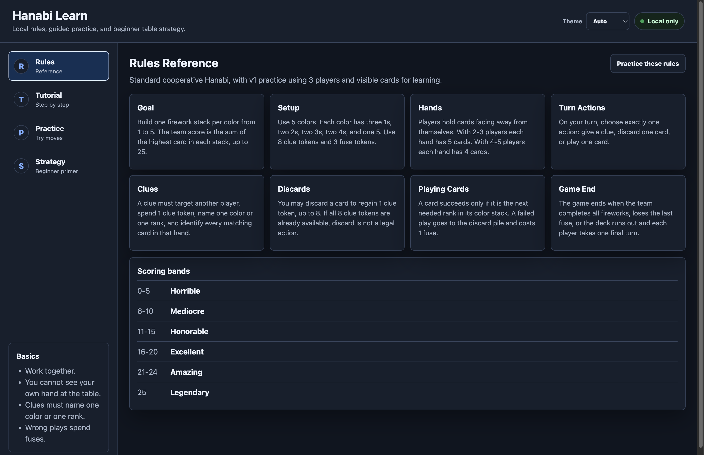
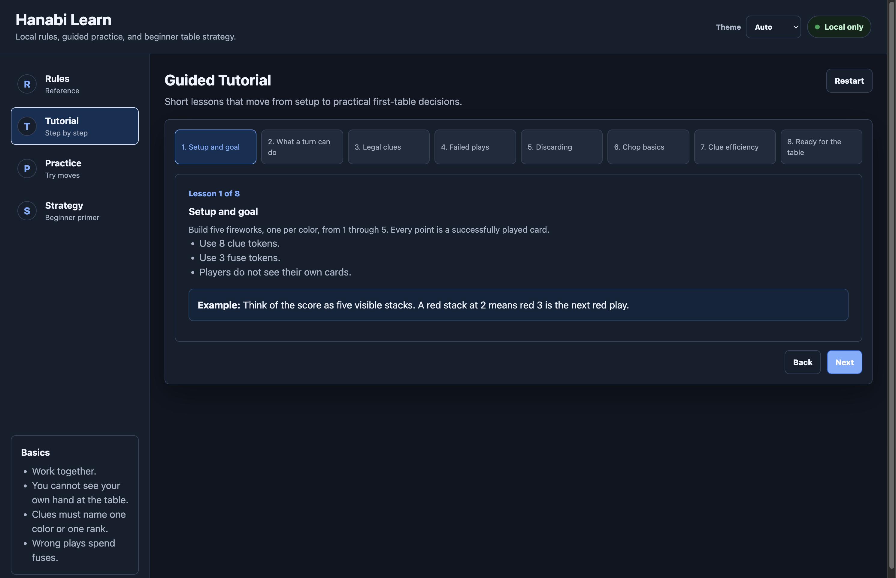
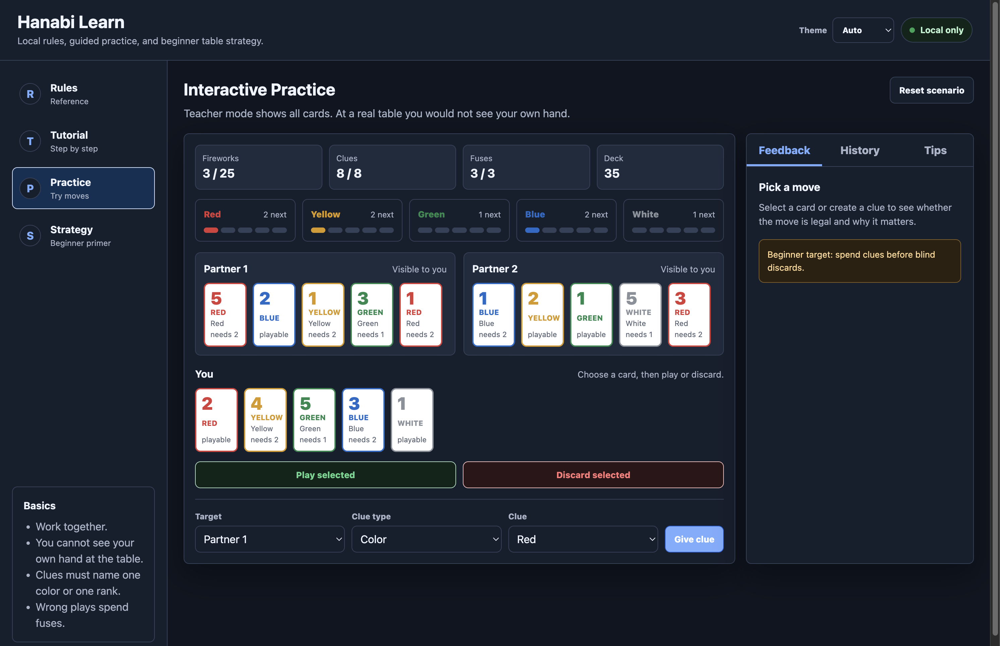
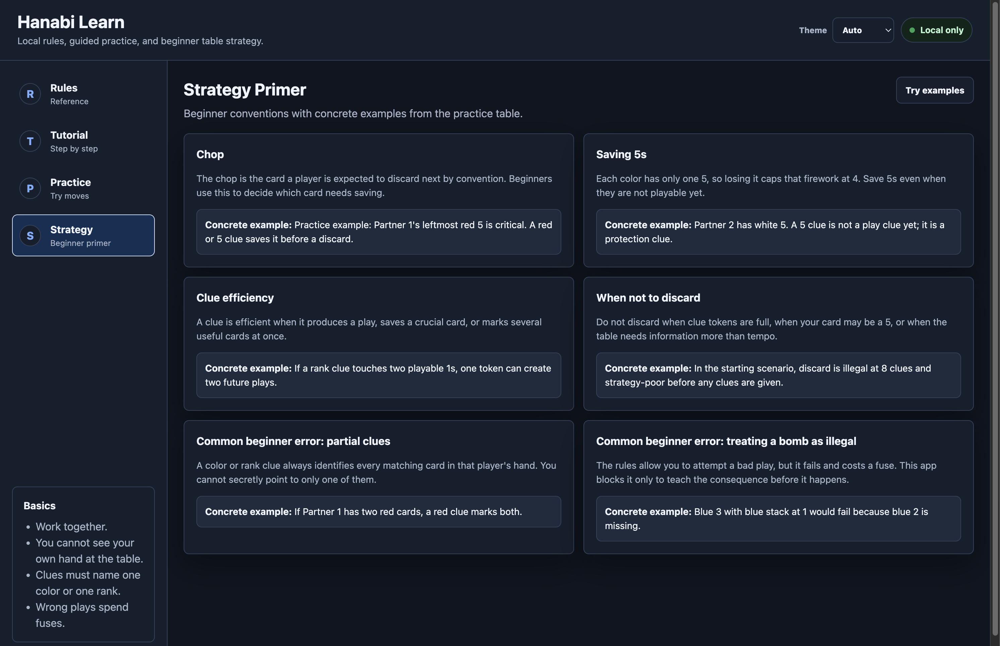

# Hanabi Learn

A local-only Hanabi learning web app for standard cooperative Hanabi. It teaches
rules, guided beginner lessons, valid move checks, and table-ready strategy
examples. There is no backend, deploy, auth, analytics, or external service.

## Screenshots

### Rules Reference



### Guided Tutorial



### Interactive Practice



### Strategy Primer



## Start

Open directly:

```bash
open index.html
```

Or run a local server:

```bash
python3 -m http.server 5173
```

Then open:

```text
http://localhost:5173
```

## What is covered

- Standard 2-5 player Hanabi with 5 colors, ranks 1-5, 8 clue tokens, and 3 fuse tokens.
- Rules reference for setup, turn actions, clue legality, failed plays, deck end, and scoring.
- Guided tutorial from setup through first clues, chop management, and beginner conventions.
- Practice mode with immediate feedback for play, discard, and clue choices.
- Strategy primer for chop, saving 5s, clue efficiency, when not to discard, and beginner errors.
- Optional multicolor/rainbow variant is mentioned as a variant only; it is not implemented in v1.

## Rule source spot-check

Primary source: R&R Games Hanabi rules PDF:

```text
https://rnrgames.com/Content/RRGames/images/ProductRules/hanabiRules.pdf
```

Spot-checked claims used by the app:

1. The game is cooperative: players work together to make fireworks in ascending order by color.
2. Each turn has one action: give a clue, discard a card, or play a card.
3. A legal clue names exactly one color or one rank and points to every matching card in the target hand.
4. Discarding returns one clue token, and discarding is not available when all clue tokens are already available.
5. A failed play costs a fuse; when the fuse limit is exhausted, the team loses.
6. The final score is the sum of the highest card successfully played in each firework.
7. Common scoring bands are 0-5 horrible, 6-10 mediocre, 11-15 honorable, 16-20 excellent, 21-24 amazing, and 25 legendary.

Edition note: some published editions represent the fuse track with a separate
explosion marker. This app models the common practical rule as 3 fuse tokens:
three failed plays end the game.

## Local verification checklist

```bash
python3 -m http.server 5173
```

Then verify in the browser:

- Tutorial: open Tutorial and click Next through Complete.
- Practice illegal clue: choose Partner 1, Color, White, then Give Clue. It should reject the clue because Partner 1 has no white cards.
- Practice failed play: select the blue 3 in your hand and click Play. It should reject as a practice guardrail because blue needs 2 next.
- Practice valid play: select the white 1 or red 2 and click Play. It should accept and update the firework.

## License

MIT — see [LICENSE](LICENSE).
